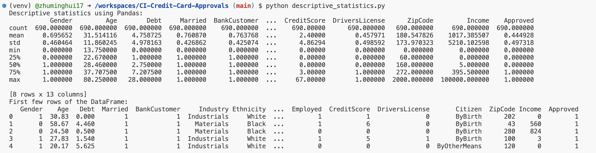

[](https://github.com/zhuminghui17/CI-Credit-Card-Approvals/actions/workflows/format.yml)
[](https://github.com/zhuminghui17/CI-Credit-Card-Approvals/actions/workflows/install.yml) [](https://github.com/zhuminghui17/CI-Credit-Card-Approvals/actions/workflows/lint.yml) [](https://github.com/zhuminghui17/CI-Credit-Card-Approvals/actions/workflows/test.yml)


# Project #1: Continuous Integration in Data Science - Credit Card Approval
This project exemplifies the effective use of Continuous Integration through GitHub Actions in a Python-based Data Science initiative. It is structured around well-organized project directories and workflows. The primary objective is to calculate descriptive statistics using libraries such as Pandas or Polars, alongside visualizing data distributions. Furthermore, the integration of GitHub Actions guarantees the maintenance of code quality by automatically executing tests, linting, and formatting with every code push or pull request.
## Dataset Overview
The Credit Card Approval dataset from the University of California Irvine (UCI) Machine Learning Repository is used to build automatic credit card approval predictors. The dataset is multivariate, with categorical, integer, and real feature types. It has 690 instances, with 55.5% of applications being denied and 44.5% being approved.

## Project Structure
Following the criteria set by Project #1's grading rubric, this project encompasses:
- A Jupyter Notebook titled `descriptive_statistics.ipynb`, showcasing the application of the `nbval` plugin with `pytest`.
- The primary Python script, `descriptive_statistics.py`, which functions as the program's entry point.
- The `lib.py` file, housing common utility functions.
- A `Makefile` designed to automate tasks like test execution and code formatting.
- Testing scripts (`test_script.py` and `test_lib.py`) for conducting unit tests on various project components.
- A `requirements.txt` file detailing all necessary project dependencies.
- Continuous integration facilitated through GitHub Actions.

## Requirements
For a complete list, refer to requirements.txt. Key requirements include:
```
Python (Version 3.6 or newer)
Pandas (Version 2.1.0)
pytest and nbval for testing
nbval (Version 0.9.6)
black for code formatting
ruff for linting
```

## Functionality

The project provides a suite of functions designed to perform various data analysis operations on a DataFrame, leveraging the capabilities of the Pandas library. Key functionalities include:

- **Reading Data:** `read_data(path)` - Reads data from a specified file path and returns a DataFrame.

- **Descriptive Analysis:** `describe_data(df)` - Provides a statistical summary of the DataFrame, including measures like mean, median, and standard deviation.

- **Previewing Data:** `head_data(df)` - Displays the first few rows of the DataFrame for a quick overview.

- **Missing Values Analysis:**
  - `missing_data(df)` - Counts and returns the number of missing values in each column.
  - `null_data(df)` - Similar to `missing_data`, it counts and returns the number of null values in each column.

- **Correlation Analysis:** `correlation_matrix(df)` - Converts string columns to numeric, if possible, and returns the correlation matrix of the DataFrame.

## Sample Output



## Project Requirements:

The project structure must include the following files:
- [x] Jupyter Notebook with:
    - [x] Cells that perform descriptive statistics using Polars or Panda.	
    - [x] Tested by using nbval plugin for pytest
			
- [x] Python Script performing the same descriptive statistics using Polars or Panda		
- [x] lib.py file that shares the common code between the script and notebook
- [x] Makefile with the following:
    - [x] Run all tests (must test notebook and script and lib)
    - [x] Formats code with Python black
    - [x] Lints code with Ruff
	- [x] Installs code via:  pip install -r requirements.txt
		
- [x] test_script.py to test script		
- [x] test_lib.py to test library
- [x] Pinned requirements.txt
- [x] GitHub Actions performs all four Makefile commands with badges for each one in the README.md
		
## Rublic

### Project Structure (15 points)

- **Jupyter Notebook**: 4 points
- **Python Script**: 4 points
- **lib.py file**: 4 points
- **Makefile**: 3 points

### Content of Jupyter Notebook and Python Script (20 points)

- **Correct and efficient use of Polars or Panda**: 10 points
- **Accuracy of descriptive statistics**: 10 points

### Testing with nbval plugin for pytest (10 points)

- **Correct usage and implementation of the nbval plugin for pytest in the Jupyter Notebook**.

### Shared code in lib.py (10 points)

- **The lib.py file correctly shares the common code between the script and notebook**.

### Makefile Commands (15 points)

- **Running all tests (notebook, script, lib)**: 5 points
- **Formatting code with Python black**: 5 points
- **Linting code with Ruff**: 5 points

### Test Scripts (10 points)

- **test_script.py**: 5 points
- **test_lib.py**: 5 points

### Requirements.txt (5 points)

- **The requirements.txt file is correctly pinned and installed via `pip install -r requirements.txt`**.

### GitHub Actions (10 points)

- **GitHub Actions correctly performs all Makefile commands and displays badges for each one in the README.md**.

### Demo Video (15 points)

- **Clarity of explanation**: 5 points
- **Quality demonstration of the project**: 5 points
- **Quality of video and audio**: 5 points


