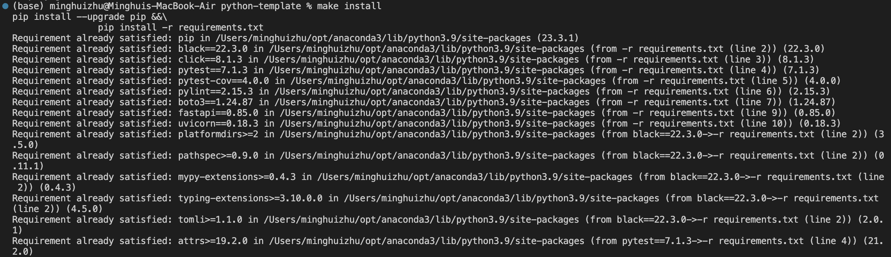
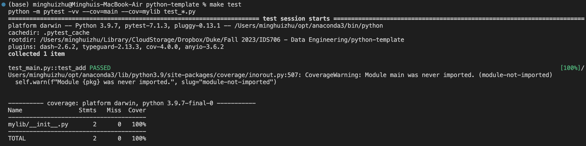
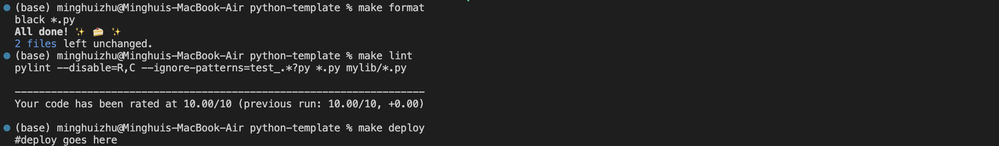
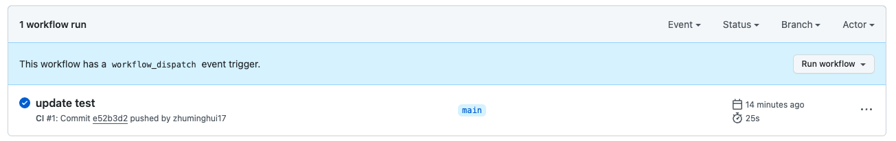

(base) minghuizhu@Minghuis-MacBook-Air CI-Credit-Card-Approvals % python3 -m venv venv
(base) minghuizhu@Minghuis-MacBook-Air CI-Credit-Card-Approvals % source venv/bin/activate

# Project #1: Continuous Integration in Data Science - Credit Card Approval
Continuous Integration using GitHub Actions of Python Data Science Project

## Dataset Overview
The Credit Card Approval dataset from the University of California Irvine (UCI) Machine Learning Repository is used to build automatic credit card approval predictors. The dataset is multivariate, with categorical, integer, and real feature types. It has 690 instances, with 55.5% of applications being denied and 44.5% being approved.

## Project Requirements:

The project structure must include the following files:
- [x] Jupyter Notebook with:
    - [x] Cells that perform descriptive statistics using Polars or Panda.	
    - [x] Tested by using nbval plugin for pytest
			
- [x] Python Script performing the same descriptive statistics using Polars or Panda		
- [x] lib.py file that shares the common code between the script and notebook
- [x] Makefile with the following:
    - [x] Run all tests (must test notebook and script and lib)
    - [x] Formats code with Python black
    - [x] Lints code with Ruff
	- [x] Installs code via:  pip install -r requirements.txt
		
- [x] test_script.py to test script		
- [x] test_lib.py to test library
- [x] Pinned requirements.txt
- [x] GitHub Actions performs all four Makefile commands with badges for each one in the README.md
		
	
This is the Python template for IDS721 Data Engineering Systems.

This document provides an overview of the key components within the project repository.

### `.devcontainer`
- **`Dockerfile`**: Defines the container's build process and environment.
- **`devcontainer.json`**: Contains configuration settings for the development environment in VS Code.

### `workflows`
- Contains GitHub Actions workflows for automated build, test, and deployment pipelines.

### `.gitignore`
- Lists the files and directories that Git should ignore.

### `Makefile`
- Used for automating compilation, testing, and other development tasks on Unix-based systems.

### `README.md`
- Offers instructions and an introduction to the project.

### `main.py`
- The main Python script of the project.

### `requirements.txt`
- Specifies all necessary libraries and packages for the project.

### `test_main.py`
- Test script designed to validate the functionality of `main.py` within IDEs.

### `img`
- Stores screenshots or images of the project's execution results.

## Continuous Integration with GitHub Actions

The project uses GitHub Actions, employing the following commands:

- `make install`: Installs project dependencies.

- `make test`: Runs unit tests.

- `make format`: Formats the code according to the specified style.
- `make lint`: Checks the code for potential errors and style issues.

### CI Results

# Rubric
# Grading Rubric for Project #1: Continuous Integration using GitHub Actions of Python Data Science Project

## Table of Contents
- [Project Structure (15 points)](#project-structure-15-points)
- [Content of Jupyter Notebook and Python Script (20 points)](#content-of-jupyter-notebook-and-python-script-20-points)
- [Testing with nbval plugin for pytest (10 points)](#testing-with-nbval-plugin-for-pytest-10-points)
- [Shared code in lib.py (10 points)](#shared-code-in-libpy-10-points)
- [Makefile Commands (15 points)](#makefile-commands-15-points)
- [Test Scripts (10 points)](#test-scripts-10-points)
- [Requirements.txt (5 points)](#requirementstxt-5-points)
- [GitHub Actions (10 points)](#github-actions-10-points)
- [Demo Video (15 points)](#demo-video-15-points)

## Project Structure (15 points)

- **Jupyter Notebook**: 4 points
- **Python Script**: 4 points
- **lib.py file**: 4 points
- **Makefile**: 3 points

## Content of Jupyter Notebook and Python Script (20 points)

- **Correct and efficient use of Polars or Panda**: 10 points
- **Accuracy of descriptive statistics**: 10 points

## Testing with nbval plugin for pytest (10 points)

- **Correct usage and implementation of the nbval plugin for pytest in the Jupyter Notebook**.

## Shared code in lib.py (10 points)

- **The lib.py file correctly shares the common code between the script and notebook**.

## Makefile Commands (15 points)

- **Running all tests (notebook, script, lib)**: 5 points
- **Formatting code with Python black**: 5 points
- **Linting code with Ruff**: 5 points

## Test Scripts (10 points)

- **test_script.py**: 5 points
- **test_lib.py**: 5 points

## Requirements.txt (5 points)

- **The requirements.txt file is correctly pinned and installed via `pip install -r requirements.txt`**.

## GitHub Actions (10 points)

- **GitHub Actions correctly performs all Makefile commands and displays badges for each one in the README.md**.

## Demo Video (15 points)

- **Clarity of explanation**: 5 points
- **Quality demonstration of the project**: 5 points
- **Quality of video and audio**: 5 points